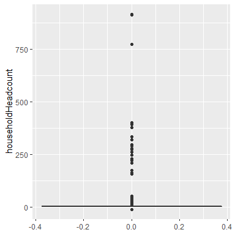
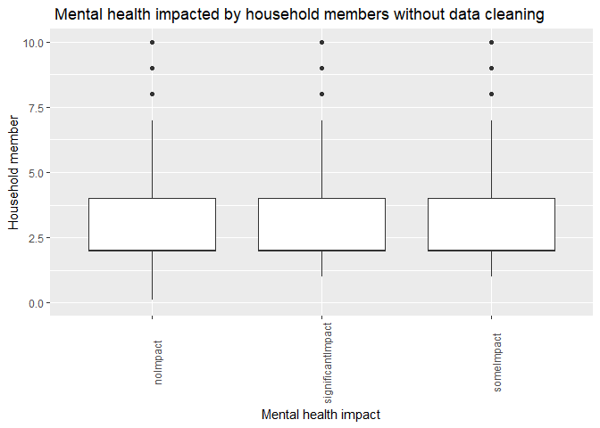
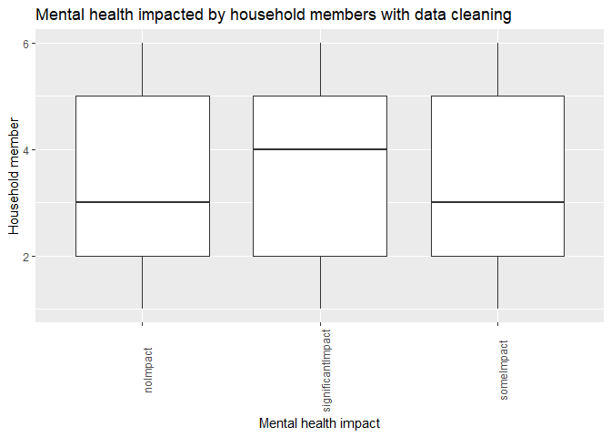
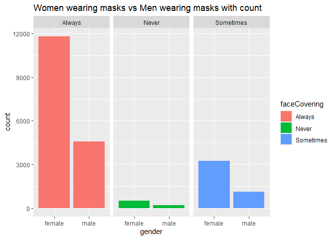
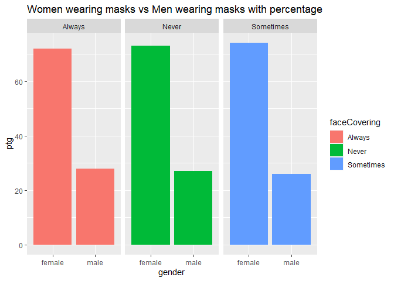
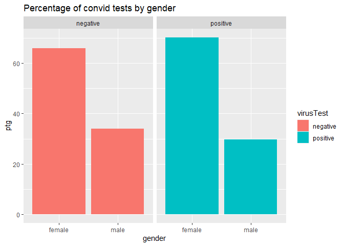
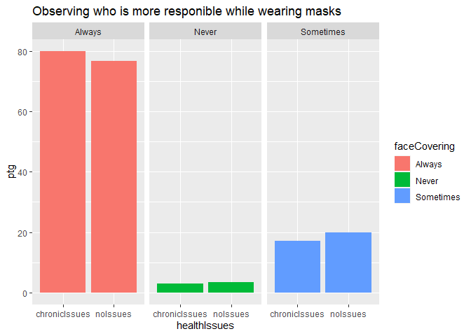
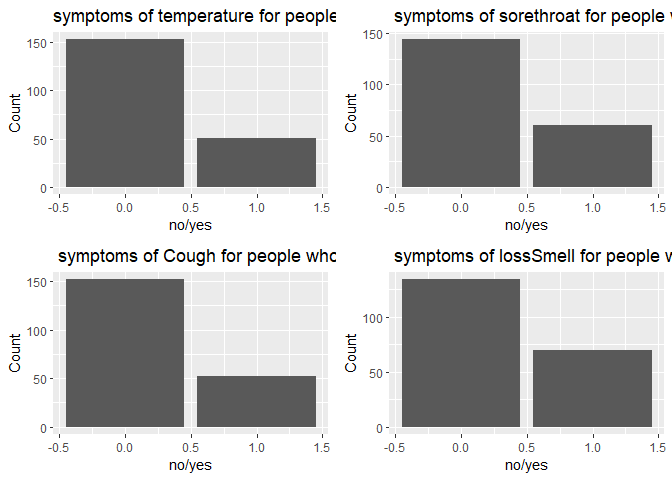

R Markdown
----------

### Data is provided by InfoGears company.

### About Data:

Data is made from questionre of random people from USA. Overall there
are 33 variables and 30088 participants.

### Description of work done on the data and the expectations and the results:

### 1.

Check how Covid influenced people’s stress level and whether if can
increase depending on number of people one is living with. This
observation was inluenced by the fact that divorse rates increased
during Covid-19. Results(more below) : As observed the more are people
one is staying with the more stressed he/she gets.

### 2.

Check which gender wears more masks by percentage. Based on that results
check which gender caught virus more and whether masks were effective or
not. Results(more below): Women wear masks more than men however
unexpectedly women got infected more than men. Therefore, the masks
weren’t that effective.

### 3.

Checking whether people with health issues are stressed about the virus,
are they wearing masks or not. Results(more below): As observed people
with ilnesses are more stressed and wear maks more than people without
ilnesses. And as expected people with illnesses caught virus less than
people having them.

### 4.

Check which sympoms are most common for people who tested positive for
Covid-19 and find out which symptoms can be indicator that one has
caught the virus. Results:the most common symptoms are lossofSmell and
Sore Troat, also Temperature and Cough are common but less than two
previosly mentioned ones. Therefore, if one has loss of Smell of Sore
throat should undoubtedely visit a doctor.

### First finding

1.  Let’s start with some data cleaning and preparation

I won’t be using columns guid and userAgent =&gt; I will remove them

Before ploting graphs I want to be sure that there are no outliers that
can make my data biased. So I will check for outliers. Also as observed
there was class imbalance problem in my data thus I took equal amount
from each class for having fair results.

We can check for outliers in two ways in first way we will count numbers
of each household in a table and secnd one using boxplot

    ## # A tibble: 56 x 2
    ##    householdHeadcount Count
    ##                 <dbl> <int>
    ##  1                  2 10258
    ##  2                  1  6213
    ##  3                  4  5168
    ##  4                  3  5162
    ##  5                  5  2008
    ##  6                  6   684
    ##  7                  7   297
    ##  8                  8   101
    ##  9                  9    57
    ## 10                 10    32
    ## # ... with 46 more rows

 So it become obvious that
there are a lot of outliers in our data from which we need to get rid
of. I think some users entered random numbers. There was also class
imbalance problem so in following step I chose equal number of classes
from householdHeadcount

    ## [1] 4.0 2.0 1.0 3.0 5.0 1.3 6.0 1.5

    ## # A tibble: 6 x 2
    ##   householdHeadcount Count
    ##                <dbl> <int>
    ## 1                  1   600
    ## 2                  2   600
    ## 3                  3   600
    ## 4                  4   600
    ## 5                  5   600
    ## 6                  6   600

let’s see what can cause mental healt impact. There can be two options
whether people feel stressed when there are few people at home or
stressed that they are locked with many household members. As we see
from the graph number of household members

    ## [1] "someImpact"        "significantImpact" "noImpact"

 \#\#\# Result: the larger is
number of household members the stressed people feel during the
lockdown. Recommendation: sometimes leave the house :))

Second Observation
==================

 \#\#\# As we see women were
more responsible and wore their masks now let’s see whether masks helped
hell women to get infected. I think yes, but let’s check.

### As we masks weren’t that effective as there are more percentage of infected women than men!!

3rd observation
===============

Now let’s see how people with Chronic illnesses feel about covid 1. as
we see below people with chronic ilnesses are more than concerned and
are stressed for their lives

    ## # A tibble: 3 x 2
    ##   mentalHealthImpact Count
    ##   <chr>              <int>
    ## 1 noImpact             338
    ## 2 significantImpact   1022
    ## 3 someImpact          1438

Below we see that people have no issues are also concerned but many said
that virus didn’t give them any kind of stress while there were very few
people with ilnesses who chose no impact =&gt; people with illnesses are
really scared

    ## # A tibble: 3 x 2
    ##   mentalHealthImpact Count
    ##   <chr>              <int>
    ## 1 noImpact            2840
    ## 2 significantImpact   3555
    ## 3 someImpact         10118

Now let’s see if people with illnesses who are scared wear masks and if
they do are they effective

As expected people with illnesses wear masks more often that people with
no issues

    ## # A tibble: 4 x 3
    ## # Groups:   healthIssues [2]
    ##   healthIssues  virusTest   ptg
    ##   <chr>         <chr>     <dbl>
    ## 1 chronicIssues negative  96.0 
    ## 2 chronicIssues positive   3.97
    ## 3 noIssues      negative  95.6 
    ## 4 noIssues      positive   4.43

ALthough people don’t get virus often people with no issues caught them
more =&gt; masks were effective (the pecentage is very small but anyways
it’s a result)

### Result: Wearing masks is effective so people should wear masks by which they would not only protect themselves but reduce stress level of people with illnesses

### Now let’s see what symtoms usually people get when testing positive

So as we see people most common sympotoms to warn you of illness is
lossSmell and Sorethroat.

Note that the `echo = FALSE` parameter was added to the code chunk to
prevent printing of the R code that generated the plot.
